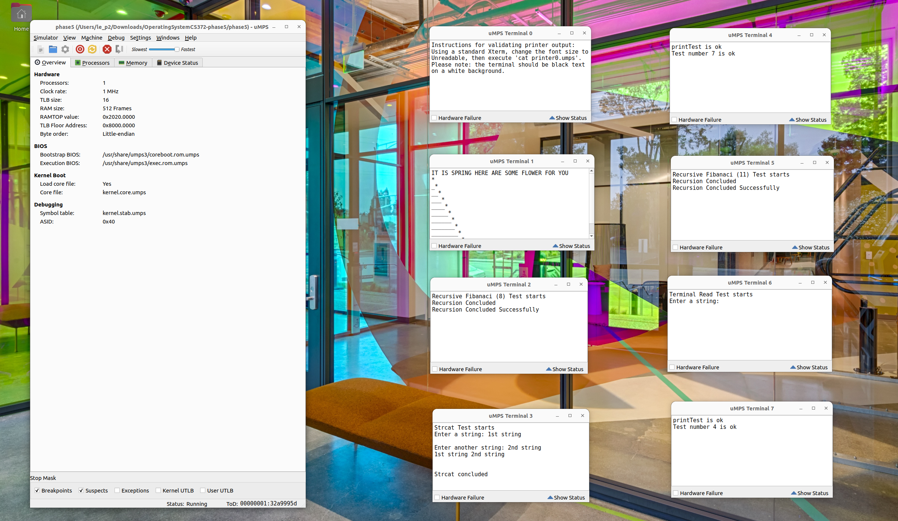

# Operating System PandOS

## Overview

PandOS is an operating system kernel implemented in C, targeting the MIPS R2/3000 RISC architecture on Linux Ubuntu. This project follows Dijkstra's layered design methodology to create a functional kernel with modern OS capabilities.

### Key Features

- **Process Management**: Multiprogramming support with preemptive scheduling and round-robin algorithm
- **System Calls**: 12 system calls supporting user-level process operations
- **Memory Management**: Virtual memory system with backing store and page tables using FIFO replacement
- **Device Support**: 4 device-specific system calls with DMA and I/O management
- **Synchronization**: Mutexes and semaphores for critical section protection and race condition prevention
- **Interrupt Handling**: Process synchronization primitives for coordinated interrupt management

### Technical Specifications

- **Language**: C
- **Architecture**: MIPS R2/3000 RISC
- **Platform**: Linux Ubuntu
- **Version Control**: Git
- **Design Pattern**: Dijkstra's layered architecture

### Core Components

- **Phase 1**: Process Control Block (PCB) and Active Semaphore List (ASL) management
- **Phase 2**: Exception handling, interrupt processing, and process scheduling
- **Phase 3**: System call implementation and virtual memory management
- **Phase 4**: Device driver support
- **Phase 5**: I/O operations and process synchronization

The operating system enables virtual memory, and communication between user-level processes while maintaining data consistency and system stability.



## Project Structure

```
PandOS/
├── h/                          # Header files
│   ├── asl.h                   # Active Semaphore List header
│   ├── const.h                 # Constants definitions
│   ├── localLibumps.h          # Local library definitions
│   ├── pcb.h                   # Process Control Block header
│   ├── print.h                 # Print utility header
│   ├── tconst.h                # Test constants
│   └── types.h                 # Type definitions
├── phase1/                     
│   ├── asl.c                   # Active Semaphore List implementation
│   ├── Makefile                # Build configuration for phase 1
│   ├── p1test.c                # Phase 1 test file
│   ├── pcb.c                   # Process Control Block implementation
├── phase2/                     
│   ├── exceptions.c            # Exception handling implementation
│   ├── exceptions.h            # Exception handling header
│   ├── initial.c               # Initialization code
│   ├── initial.h               # Initialization header
│   ├── interrupts.c            # Interrupt handling implementation
│   ├── interrupts.h            # Interrupt handling header
│   ├── Makefile                # Build configuration for phase 2
│   ├── p2test.c                # Phase 2 test file
│   ├── scheduler.c             # Process scheduler implementation
│   └── scheduler.h             # Process scheduler header
├── phase3/                     # Phase 3 implementation
│   ├── initProc.c              # Initial process implementation
│   ├── initProc.h              # Initial process header
│   ├── Makefile                # Build configuration for phase 3
│   ├── sysSupport.c            # System support implementation
│   ├── sysSupport.h            # System support header
│   ├── vmSupport.c             # Virtual memory support implementation
│   ├── vmSupport.h             # Virtual memory support header
│   └── testers/                # Test programs directory
├── phase4/                     # Phase 4 implementation
│   ├── devSupport.c            # Device support implementation
│   └── devSupport.h            # Device support header
└── phase5/                     # Phase 5 implementation
    ├── delayDaemon.c           # Delay daemon implementation
    ├── delayDaemon.h           # Delay daemon header
    ├── diskIOtest.c            # Disk I/O test implementation
    ├── Makefile                # Build configuration for phase 5
    ├── print.c                 # Print utility implementation
    ├── pvTestA.c               # Producer-consumer test A
    ├── pvTestB.c               # Producer-consumer test B
    └── h/                      # Phase 5 header files
        ├── localLibumps.h      # Local library definitions
        ├── print.h             # Print utility header
        └── tconst.h            # Test constants
```
